# Test Cases - Testes Manuais em Sites Públicos

---

## CT-01: Validação de busca de produto - Mercado Livre

**Prioridade:** Alta  
**Severidade:** Alta  
**Tipo de teste:** Funcional  

**Passos:**
1. Acessar o site
2. Buscar por "notebook"
3. Validar os resultados exibidos
4. Aplicar filtros (marca, preço)
5. Ordenar por menor preço

**Resultado esperado:**
- Sistema deve exibir produtos relacionados a "notebook"
- Resultados devem ser relevantes
- Filtros devem ser aplicados corretamente
- Ordenação deve respeitar o critério selecionado

**Evidência:**

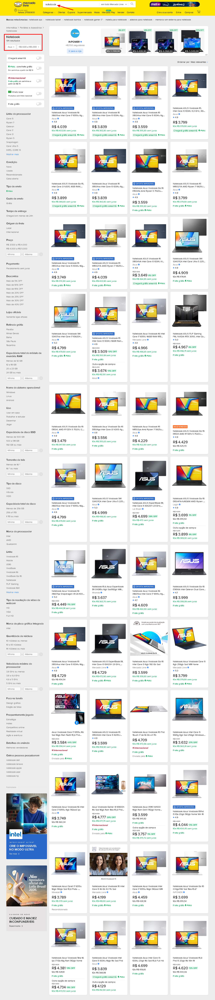

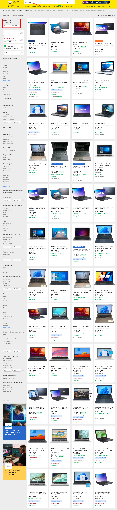

---

CT-02: Abertura do menu lateral

Prioridade: Média  
Severidade: Média  
Tipo de teste: Usabilidade / Interface  

Passos:

1. Acessar a página inicial da Amazon
2. Clicar no menu "Todos"
3. Observar a abertura do menu lateral

Resultado esperado:

- O menu lateral deve abrir corretamente
- As categorias devem ser exibidas
- O layout deve estar organizado e legível

Evidência:

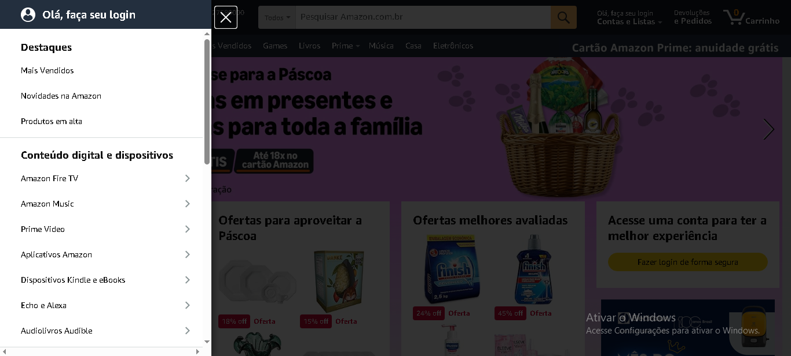

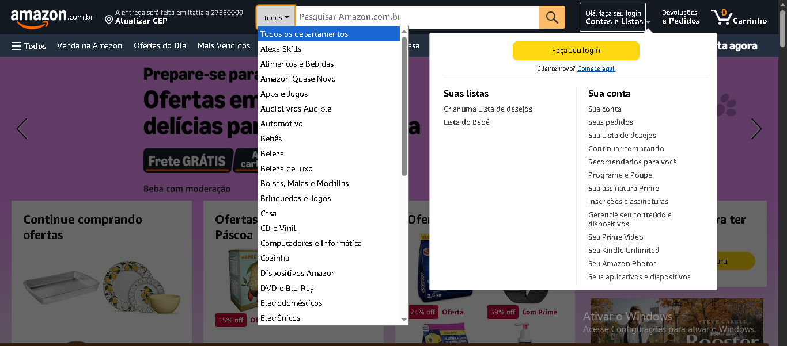
---

CT-03: Validação de email inválido no cadastro(Linkedin)

Prioridade: Alta  
Severidade: Média  
Tipo de teste: Funcional  

Passos:

1. Acessar a página de cadastro do LinkedIn
2. Inserir um email inválido (ex: giordanocaruso)
3. Clicar em "Aceite e cadastre-se"

Resultado esperado:

- O sistema deve exibir mensagem de erro informando email inválido
- O campo deve ser destacado visualmente (ex: borda vermelha)

Evidência:

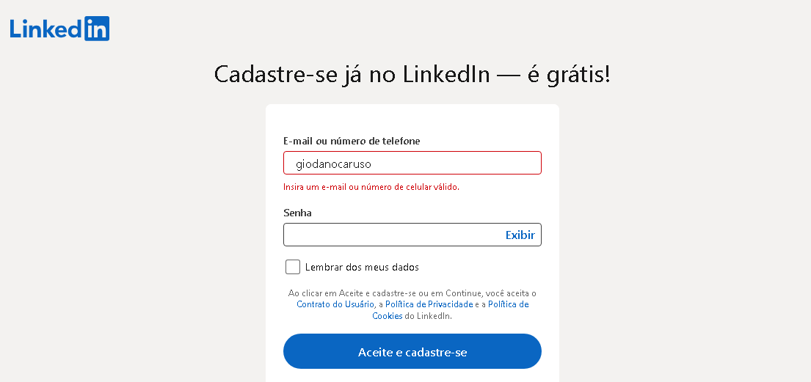

---

CT-04: Validação de campos obrigatórios vazios(Linkedin)

Prioridade: Alta  
Severidade: Alta  
Tipo de teste: Funcional  

Passos:

1. Acessar a página de cadastro do LinkedIn
2. Deixar os campos de email e senha vazios
3. Clicar em "Aceite e cadastre-se"

Resultado esperado:

- O sistema deve exibir mensagens informando que os campos são obrigatórios
- Os campos devem ser destacados visualmente

Evidência:

---

CT-05: Validação de senha com baixo nível de segurança

Prioridade: Alta  
Severidade: Média  
Tipo de teste: Funcional  

Passos:

1. Acessar a página de cadastro do LinkedIn
2. Inserir um email válido
3. Inserir uma senha fraca (ex: 123456)
4. Clicar em "Aceite e cadastre-se"

Resultado esperado:

- O sistema deve exibir mensagem informando que a senha não atende aos requisitos de segurança
- O usuário não deve conseguir prosseguir com o cadastro

Evidência:

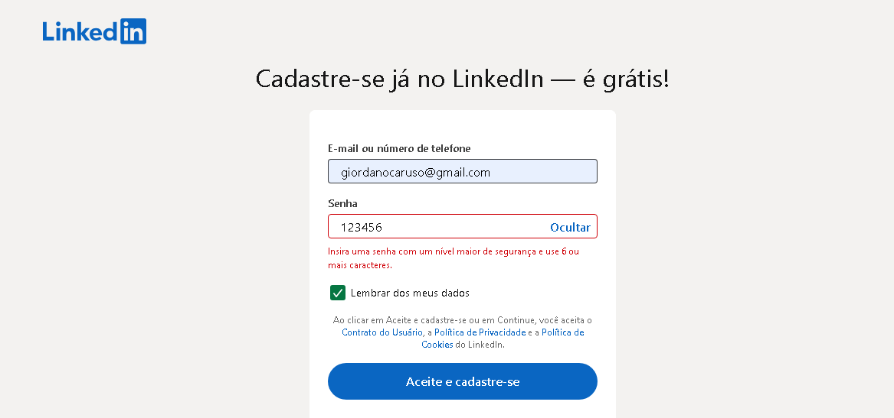

---

CT-06: Login com senha inválida

Prioridade: Alta  
Severidade: Alta  
Tipo de teste: Funcional  

Passos:
1. Acessar página de login do Magazine Luiza
2. Inserir e-mail válido
3. Inserir senha incorreta
4. Clicar em "Continuar"

Resultado esperado:
- O sistema deve exibir mensagem de erro informando credenciais inválidas
- O login não deve ser realizado

Evidência:
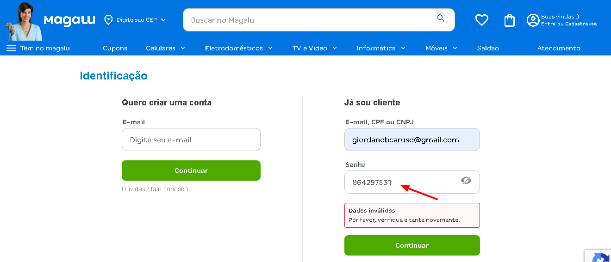

---

CT-07: Login com e-mail inválido

Prioridade: Alta  
Severidade: Média  
Tipo de teste: Funcional  

Passos:
1. Acessar página de login
2. Inserir e-mail sem formato válido (sem "@")
3. Clicar em "Continuar"

Resultado esperado:
- O sistema deve validar o formato do e-mail
- Deve exibir mensagem de erro apropriada

Evidência:
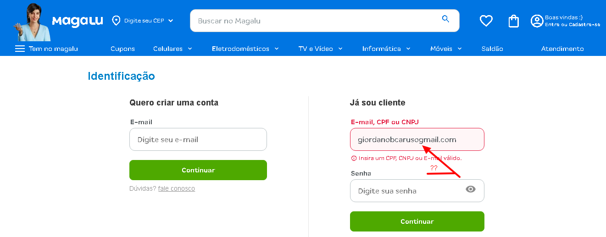

---

CT-08: Validação de campo senha obrigatório

Prioridade: Alta  
Severidade: Média  
Tipo de teste: Funcional  

Passos:
1. Inserir e-mail válido
2. Deixar o campo senha vazio
3. Clicar em "Continuar"

Resultado esperado:
- O sistema deve exigir preenchimento do campo senha
- Deve exibir mensagem de erro

Evidência:
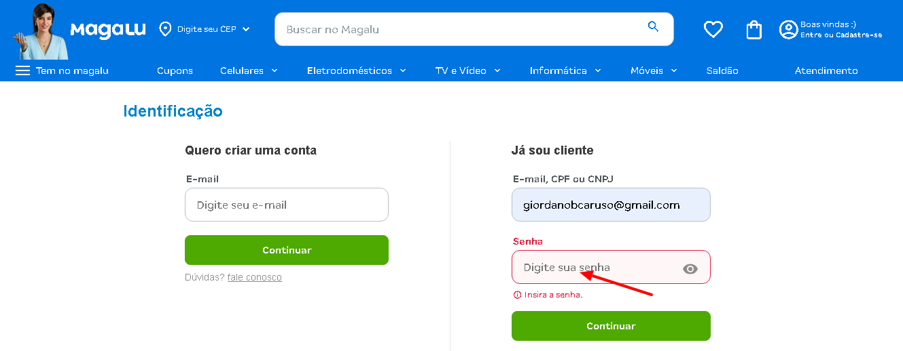

---

CT-09: Validação de campo e-mail obrigatório

Prioridade: Alta  
Severidade: Média  
Tipo de teste: Funcional  

Passos:
1. Deixar o campo e-mail vazio
2. Inserir senha válida
3. Clicar em "Continuar"

Resultado esperado:
- O sistema deve exigir preenchimento do campo e-mail
- Deve exibir mensagem de erro

Evidência:
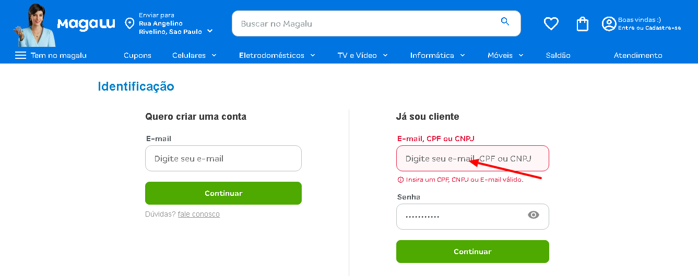

---

CT-10: Funcionalidade mostrar/ocultar senha

Prioridade: Média  
Severidade: Baixa  
Tipo de teste: Usabilidade  

Passos:
1. Inserir uma senha no campo
2. Clicar no ícone de visualização (olho)

Resultado esperado:
- A senha deve alternar entre visível e oculta corretamente

Evidência:
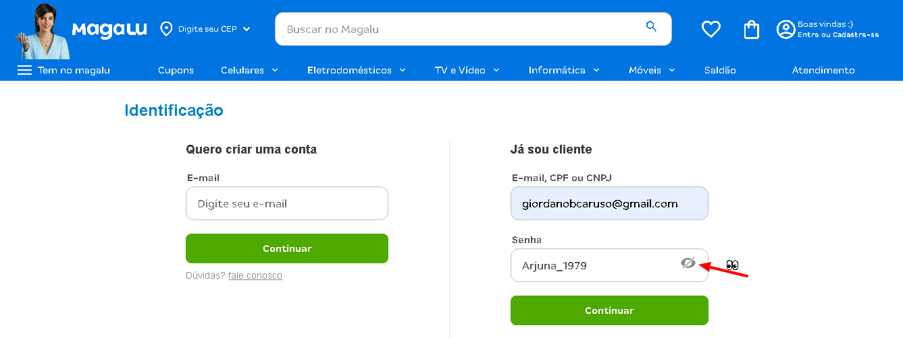

---

CT-11: Validação de tamanho mínimo de senha

Prioridade: Média  
Severidade: Média  
Tipo de teste: Funcional  

Passos:
1. Inserir e-mail válido
2. Inserir senha abaixo do limite mínimo
3. Clicar em "Continuar"

Resultado esperado:
- O sistema deve impedir login com senha inválida
- Deve exibir mensagem clara sobre o requisito de senha

Evidência:
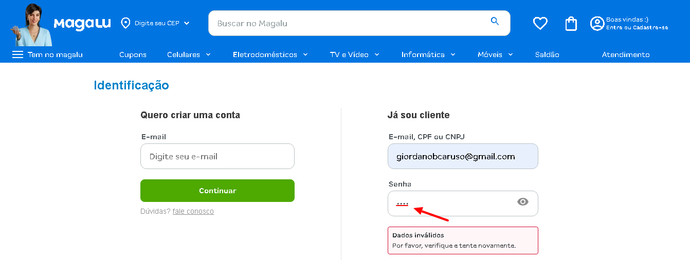
